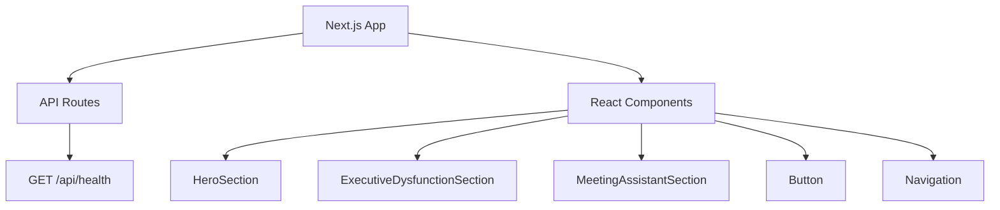

# Velvet-Website

Velvet's Website - Do check out <3

# Velvet Website

<div align="center">

A stunning web experience designed with love and care for the Velvet community.


<br/><br/>

</div>

## 🛠️ Tech Stack

<div align="center">


<br/>

<br/><br/>

</div>

## 📊 GitHub Stats

<div align="center">

<a href="https://github.com/Fayeq-qamar/Velvet-Website">
  
</a>

<br/>
<br/><br/>

</div>

## 🚀 Features

<div align="center">

<table>
  <tr>
    <td align="center" width="33%" style="background: #1a1a1a; border: 2px solid #8B5FBF; border-radius: 10px; padding: 20px;">
      
      <br/><br/>
      <strong>🧠 Intuitive Layout</strong>
      <br/>
      <p>Well-structured sections for easy navigation.</p>
    </td>
    <td align="center" width="33%" style="background: #1a1a1a; border: 2px solid #E91E63; border-radius: 10px; padding: 20px;">
      
      <br/><br/>
      <strong>🚀 Real-Time Updates</strong>
      <br/>
      <p>Instant data refresh for optimal user experience.</p>
    </td>
    <td align="center" width="33%" style="background: #1a1a1a; border: 2px solid #9C27B0; border-radius: 10px; padding: 20px;">
      
      <br/><br/>
      <strong>💻 Interactive Components</strong>
      <br/>
      <p>Reusable React components for efficient development.</p>
    </td>
  </tr>
</table>

<br/><br/>

</div>

## 🏗️ Architecture

<div align="center">



<br/><br/>

</div>

## 🎯 Quick Start

<div align="center">

<table>
  <tr>
    <th width="50%" style="background: #1a1a1a; border: 2px solid #8B5FBF; padding: 15px;">
      <h3>🛠️ Development Mode</h3>
    </th>
    <th width="50%" style="background: #1a1a1a; border: 2px solid #E91E63; padding: 15px;">
      <h3>🚀 Safe Mode</h3>
    </th>
  </tr>
  <tr>
    <td style="background: #0d1117; border: 2px solid #8B5FBF; padding: 15px;">

```bash
npm run dev
```

Run with hot reload
    </td>
    <td style="background: #0d1117; border: 2px solid #E91E63; padding: 15px;">

```bash
npm run dev:safe
```

Run with minimal modules for debugging
    </td>
  </tr>
</table>

<br/><br/>

</div>

## 📦 Installation

<div align="center">

```bash

# Clone the repository
git clone https://github.com/Fayeq-qamar/Velvet-Website.git

# Navigate to project directory
cd Velvet-Website

# Install dependencies
npm install

# Run the application
npm start
```

<br/><br/>

</div>

## 🔧 Key Components

<div align="center">

| Component | Language | Purpose |
|-----------|----------|---------|
| HeroSection | TypeScript | Renders the hero section of the website |
| ExecutiveDysfunctionSection | TypeScript | Provides insights for executive dysfunction |
| MeetingAssistantSection | TypeScript | Assists in managing meetings |
| Button | TypeScript | Reusable button component |

<br/><br/>

</div>

## 🤝 Contributing

<div align="center">

We welcome contributions! Here's how:

1. Fork the repository
2. Create a feature branch
3. Make your changes
4. Submit a pull request

<br/><br/>

</div>

## 📝 License

<div align="center">

This project is licensed under the MIT License - see the [LICENSE](LICENSE) file for details.

<br/><br/>

</div>

<div align="center">


</div>
```

